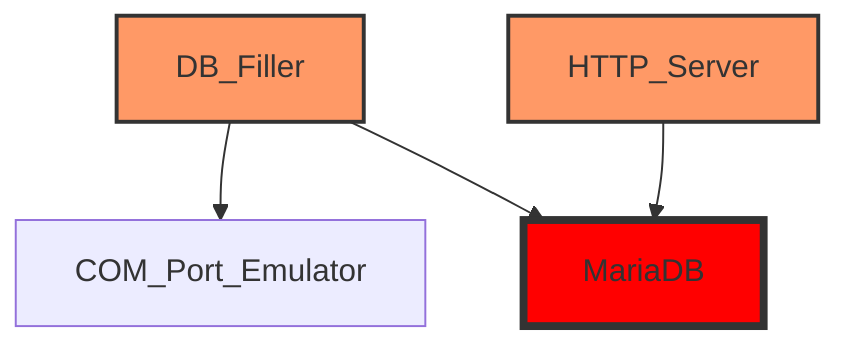

# Лабораторная работа #5
TODO:!!!
В рамках данной лабораторной работы необходимо написать кроссплатформенную программу, которая прослушивает по `COM`-порту температуру окружающей среды и логирует её.

В первый лог-файл `measurements.log` показания пишутся раз в минуту и хранятся не более суток.

Во второй лог-файл `hourly_average.log` пишется среднее значение за час и лог хранится не более месяца.

В третий лог файл `daily_average.log` пишется среднее значение за день и лог хранится не более года.

## Описание
Для работы с `COM`-портами используется кроссплатформенная библиотека из предыдущей лабораторной [com](include/com.h).

Также с предыдущей лабораторной работы был взят эмулятор устройства, передающий текущую температуру по `COM`-порту [emulator.c](emulator.c).


### Архитектура
Для реализации текущей лабораторной было принято решение использовать современную [микросервисную](https://en.wikipedia.org/wiki/Microservices) архитектуру при проектировании решения.



#### DB Filler
Первый микросервис ([db_filler](db_filler.c)) занимается чтением текущей температуры из `COM`-порта и записью данных в БД.

Была выбрана СУБД [MariaDB](https://mariadb.org/).

Данный сервис раз в секунду считывает данные о текущей температуре, и когда набирается необходимое количество пачкой записывает данные в БД.


## Инструкция по запуску

### База данных
[Инструкция по установке MariaDB](https://mariadb.com/kb/en/binary-packages/).

Также необходимо установить `C-connector` для MariaDB - [ссылка](https://mariadb.com/docs/server/connect/programming-languages/c/install/).

Далее, нужно подключиться к СУБД из терминала:
```sh
mysql -u <username> -p
```

Затем нужно создать базу данных:
```sql
CREATE DATABASE temperature_db;
USE temperature_db;
```

После этого нужно подготовить базу данных при помощи [sql/temperature.sql](sql/temperature.sql).
```sql
SOURCE sql/temperature.sql;
```

Проверить созданные таблицы можно при помощи:
```sql
SHOW TABLES;
```

### Сборка и запуск
```
Если во время сборки СMake не находит библиотеку для работы с MariaDB, то укажите переменную `MYSQL_HOME` с директорией C-connector.

Например, на windows после установки `C-connector` в powershell:

$env:MYSQL_HOME = "C:\Program Files\MariaDB\MariaDB Connector C 64-bit"
```

Сборка осуществляется при помощи CMake.

Создадим директорию `build`:
```sh
mkdir build && cd build
```

Далее запустим сборку:
```sh
cmake .. && make
```

После этого надо запустить эмулятор сборщика температуры:
```sh
./emulator
```

Затем, сервис по записи температуры в БД:
```sh
./db_filler
```

И наконец, сам http-сервер:
```sh
TODO: Не готов
```

