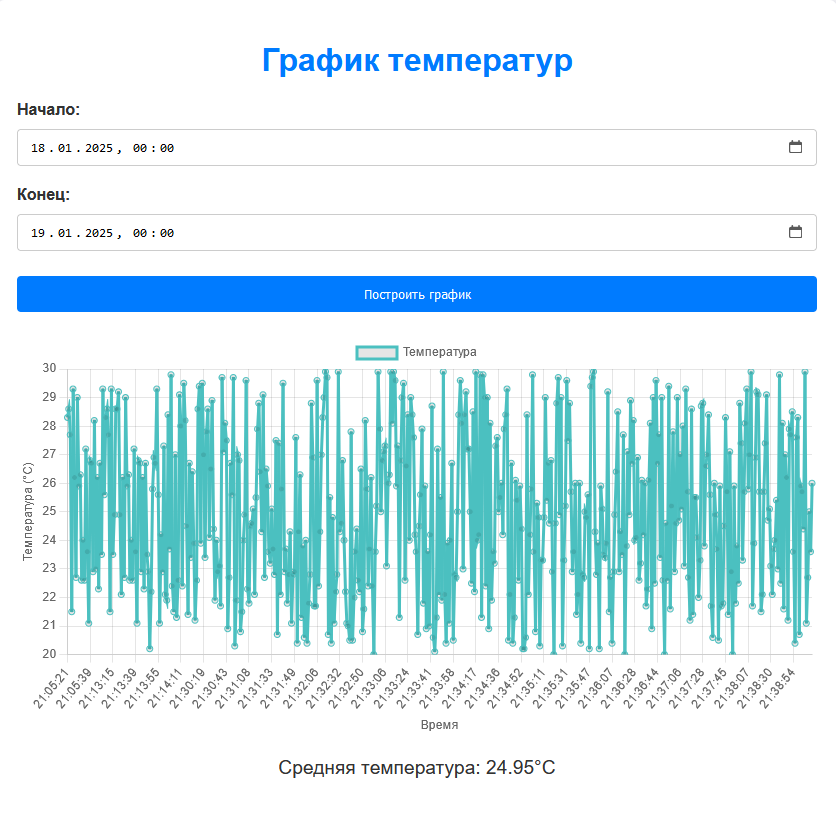

# Лабораторная работа #5
Для программы, написанной в ходе предыдущей лабораторной работы необходимо добавить функционал сетевого сервера с возможностью публиковать по HTTP-запросу текущую температуру, а также статистику за выбранный период времени.

- Вместо записи в файлы, сохранять температуру в базу данных.

- Написать для сервера клиентское веб-приложение, позволяющее отображать данные в наглядном виде.

## Описание
Для работы с `COM`-портами используется кроссплатформенная библиотека из предыдущей лабораторной [com](include/com.h).

Также с предыдущей лабораторной работы был взят эмулятор устройства, передающий текущую температуру по `COM`-порту [emulator.c](emulator.c).


### Архитектура
Для реализации текущей лабораторной работы было принято решение использовать современную [микросервисную](https://en.wikipedia.org/wiki/Microservices) архитектуру при проектировании решения.
```mermaid
flowchart LR
    COM_Port_Emulator --> DB_Filler
    DB_Filler --> MariaDB
    MariaDB --> HTTP_Server

    class DB_Filler, HTTP_Server, service
    class MariaDB database

    classDef service stroke:#333,stroke-width:2px
    classDef database stroke:#333,stroke-width:2px
```


#### DB Filler
Первый микросервис ([db_filler](db_filler.c)) занимается чтением текущей температуры из `COM`-порта и записью данных в БД.

Была выбрана СУБД [MariaDB](https://mariadb.org/).

Данный сервис раз в секунду считывает данные о текущей температуре, и когда набирается необходимое количество пачкой записывает данные в БД.

#### HTTP Server
Представляет собой HTTP-API, имеет один эндпоинт:
> GET /data?start=<start_time>&end=<end_time>

Этот эндпоинт предназначен для обработки HTTP-запросов на получение данных о температуре в заданном временном интервале.

**Логика обработки запроса**

- Если запрос не начинается с GET /data? либо некорректные `query`-параметры то возвращается ошибка с кодом 400 Bad Request и сообщением.
- Если данные успешно получены, формируется ответ с кодом 200 OK и возвращается JSON-объект с результатами.

**Пример ответа**
> /data?start=1737200333&end=1737200335"
```json
{
  "measurements": [
    {
      "value": 28.5,
      "timestamp": 1737200333
    },
    {
      "value": 23.6,
      "timestamp": 1737200334
    },
    {
      "value": 20.4,
      "timestamp": 1737200335
    }
  ],
  "average": 24.17
}
```

#### Frontend
Для отображения графика и данных, полученных с API, использован HTML и CSS. 
Веб-интерфейс позволяет пользователю указать временной интервал для получения данных о температуре и отображения графика с 
результатами. 
После получения данных от API на основе выбранного интервала, график строится с использованием JavaScript и 
библиотеки для визуализации данных.



## Инструкция по запуску

### База данных
[Инструкция по установке MariaDB](https://mariadb.com/kb/en/binary-packages/).

Также необходимо установить `C-connector` для MariaDB - [ссылка](https://mariadb.com/docs/server/connect/programming-languages/c/install/).

Далее, нужно подключиться к СУБД из терминала:
```sh
mysql -u <username> -p
```

Затем нужно создать базу данных:
```sql
CREATE DATABASE temperature_db;
USE temperature_db;
```

После этого нужно подготовить базу данных при помощи [sql/temperature.sql](sql/temperature.sql).
```sql
SOURCE sql/temperature.sql;
```

Проверить созданные таблицы можно при помощи:
```sql
SHOW TABLES;
```

### Сборка и запуск
```
Если во время сборки СMake не находит библиотеку для работы с MariaDB, то укажите переменную `MYSQL_HOME` с директорией C-connector.

Например, на windows после установки `C-connector` в powershell:

$env:MYSQL_HOME = "C:\Program Files\MariaDB\MariaDB Connector C 64-bit"
```

Сборка осуществляется при помощи CMake.

Создадим директорию `build`:
```sh
mkdir build && cd build
```

Далее запустим сборку:
```sh
cmake .. && make
```

После этого надо запустить эмулятор сборщика температуры:
```sh
./emulator
```

Затем, сервис по записи температуры в БД:
```sh
./db_filler
```

И наконец, сам http-сервер:
```sh
TODO: Не готов
```

